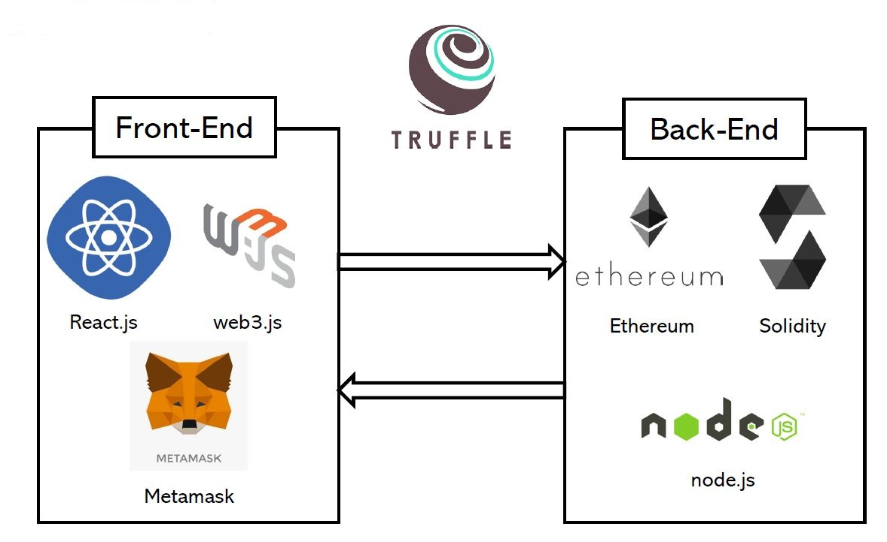

# Indian: Game Distribution Platform dApp

Indian is a Game Distribution Platform DApp such as Steam, Origin etc


## Features
* Blockchain can help Indie Game Developer
* Blockchain based investment makes more better environment for Indie Game Developer.
* Our project is for Gyeongi-Do Blockchain Hackathon 2019 (경기도 블록체인 해커톤 2019)

## Installation

``` npm install

``` truffle compile

``` truffle migrate

``` cd client && npm start

## Indian's Architecture

